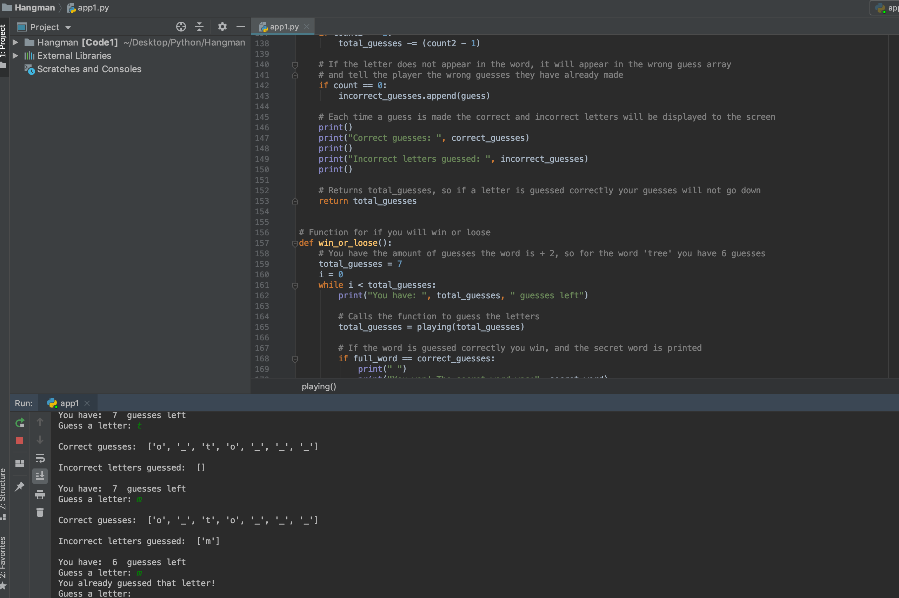

# Hangman

# Program
This program is used to generate a hangman game to be played in the console. The 'secret word' or word to be guessed must be written in, and then an individual would be able to try and guess this secret word.

I got quite comfortable with the language after this coding exercise and started being comfortable in using if statements, for loops, and other programming aspects. The program uses interacting fucntions which all acomplish different parts for the game to work. 

I started with if statements for checking whether there are arbitrary symbols, had numbers included... This however meant if you guessed a number, then tried a symbol which is not in the alphabet, it would then accept the number. I changed the method to check if all characters fit in an array of allowed characters; this fixed this problem.

# Problems:

I wanted the word to be entered through the console (e.g. person 1 would enter the wor, and person 2 would guess it. Both people would be present at the same time just like in the original game). This however means person 2 can scroll up and see the secret word becuase I did not find a way to clear the console. 

You can also click enter on its own (without writing anything), and this sometimes causes an error.
